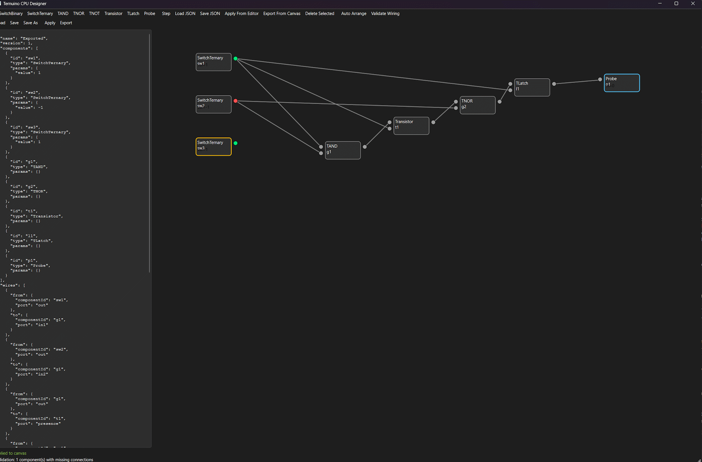

# Ternuino CPU Designer

This is an interactive Python tool to design and test ternary/binary CPU logic from scratch. 
Build circuits from JSON or via the GUI, simulate step-by-step, and visualize signals.
This is part of the Ternuino Project initiated by Swen "El Dockerr" Kalski to create a ternary CPU design to make computing more efficient.

For more information about Ternuino and ternary computing please go to [ternuino.cpu.simulator](https://github.com/el-dockerr/ternuino.cpu.simulator/tree/main)

## Features

- Balanced ternary signals {-1, 0, 1} with simple resolution rules on wires.
- Components: switches (binary/ternary), gates (TAND, TNOR, TNOT), ternary transistor, latch (memory), probe (LED).
- JSON design format to declare components and wires.
- GUI editor/viewer to place components, wire ports, toggle switches, and step the simulation.



## Quick Start

1) Requirements: Python 3.9+.
2) Install dependencies:

```powershell
pip install -r requirements.txt
```

3) Run the GUI:

```powershell
python -m ternuino_designer.main
```

4) Load the sample design from `examples/sample_design.json`. The left panel shows the JSON you can edit; use Apply or Save to update, and the right canvas updates to match. Click Step to propagate and toggle switches by clicking them.

## JSON Design

File structure:

```json
{
  "name": "My Circuit", 
  "version": 1,
  "components": [
    {"id": "sw1", "type": "SwitchBinary", "position": {"x": 100, "y": 100}, "params": {"value": 1}},
    {"id": "g1", "type": "TNOT", "position": {"x": 260, "y": 100}},
    {"id": "p1", "type": "Probe", "position": {"x": 420, "y": 100}}
  ],
  "wires": [
    {"from": {"componentId": "sw1", "port": "out"}, "to": {"componentId": "g1", "port": "in"}},
    {"from": {"componentId": "g1", "port": "out"}, "to": {"componentId": "p1", "port": "in"}}
  ]
}
```

Supported component types and ports:

- SwitchBinary: out
- SwitchTernary: out
- TAND: in1, in2, out
- TNOR: in1, in2, out
- TNOT: in, out
- Transistor: presence, sign, out
- TLatch: in, enable, out
- Probe: in

## Ternary Logic

- Values: -1 (neg), 0 (null), 1 (pos)
- Gates: TNOT(x) = -x, TAND(x,y) = min(x,y), TOR(x,y) = max(x,y), TNOR(x,y) = -max(x,y)
- Transistor: if presence != 0 and sign != 0 => out = sign else out = 0
- Wire resolution: if drivers include both -1 and 1 => 0; else the non-zero if any; else 0

## Memory

TLatch stores last input when enable == 1, else holds. Outputs current stored value.

## Keyboard / Mouse

- Left-click switch to toggle: Binary cycles 0 -> 1 -> 0; Ternary cycles -1 -> 0 -> 1 -> -1
- Drag to move components.
- Right-click on component delete a component.
- Click a port circle to start a wire, then click another port to connect.
- Toolbar: Add components, Step, Run/Stop (optional), Load/Save.

## Testing without GUI

Run a small smoke test:

```powershell
python tests/smoke_test.py
```

## Roadmap

- [ ] More gate types and composite components.
- [ ] Clocked flip-flops, RAM blocks.
- [ ] Bus wires and labels.
- [ ] Validation and auto-layout.
